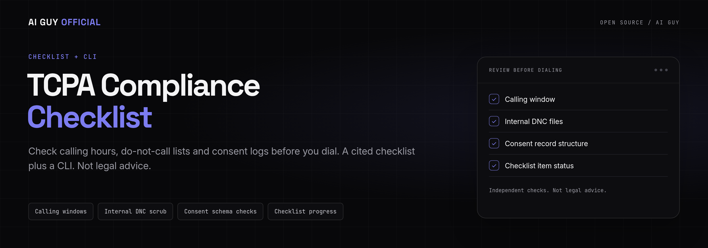
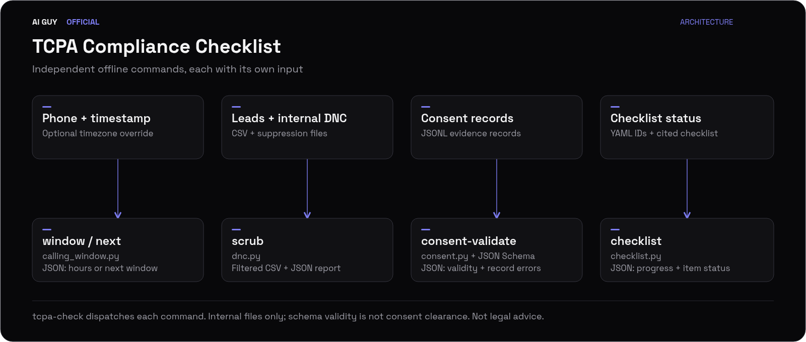

<p align="center">
  
</p>

<p align="center">
  <strong>Check calling hours, do-not-call lists and consent logs before you dial. A cited checklist plus a CLI. Not legal advice.</strong>
</p>

<p align="center">
  <a href="https://github.com/jbrazy480/tcpa-compliance-checklist/actions/workflows/ci.yml?utm_source=github&amp;utm_medium=readme&amp;utm_campaign=tcpa-compliance-checklist&amp;utm_content=ci"></a>
  <a href="https://github.com/jbrazy480/tcpa-compliance-checklist/blob/main/LICENSE?utm_source=github&amp;utm_medium=readme&amp;utm_campaign=tcpa-compliance-checklist&amp;utm_content=license"></a>
  <a href="https://github.com/jbrazy480/tcpa-compliance-checklist/blob/main/pyproject.toml?utm_source=github&amp;utm_medium=readme&amp;utm_campaign=tcpa-compliance-checklist&amp;utm_content=python"></a>
  <a href="https://github.com/jbrazy480/tcpa-compliance-checklist/blob/main/consent_log.schema.json?utm_source=github&amp;utm_medium=readme&amp;utm_campaign=tcpa-compliance-checklist&amp;utm_content=schema"></a>
  <a href="https://github.com/jbrazy480/tcpa-compliance-checklist/blob/main/checklist.yaml?utm_source=github&amp;utm_medium=readme&amp;utm_campaign=tcpa-compliance-checklist&amp;utm_content=yaml"></a>
  <a href="https://www.skool.com/evolving-ai-hub?utm_source=github&amp;utm_medium=readme&amp;utm_campaign=tcpa-compliance-checklist&amp;utm_content=community"></a>
  <a href="https://rizzdial.com/booked?utm_source=github&amp;utm_medium=readme&amp;utm_campaign=tcpa-compliance-checklist&amp;utm_content=done-for-you"></a>
</p>

<p align="center">
  <a href="https://www.skool.com/evolving-ai-hub?utm_source=github&amp;utm_medium=readme&amp;utm_campaign=tcpa-compliance-checklist&amp;utm_content=community"></a>
  <a href="https://rizzdial.com/booked?utm_source=github&amp;utm_medium=readme&amp;utm_campaign=tcpa-compliance-checklist&amp;utm_content=done-for-you"></a>
  <a href="https://aiguyofficial.com/resources?utm_source=github&amp;utm_medium=readme&amp;utm_campaign=tcpa-compliance-checklist&amp;utm_content=resources"></a>
</p>

<p align="center">Learn with James Hill's free Evolving AI Hub community, get AI calling set up on RizzDial, or explore free resources.</p>

## See the checks run

<p align="center">
  
</p>

The demo runs locally with fictional numbers and no API keys; checklist output is summarized for readability.

## What you can check

<table>
  <tr>
    <td width="33%"><strong>Cited checklist</strong><br>Review campaign controls in Markdown and YAML with stable item IDs.</td>
    <td width="33%"><strong>Local calling hours</strong><br>Check every candidate IANA timezone, including DST offsets.</td>
    <td width="33%"><strong>Next allowed time</strong><br>Find the next shared window as an aware UTC timestamp.</td>
  </tr>
  <tr>
    <td><strong>Internal DNC scrub</strong><br>Remove matches against your supplied suppression files.</td>
    <td><strong>Consent record validation</strong><br>Check JSONL evidence structure against JSON Schema.</td>
    <td><strong>Checklist progress</strong><br>Track todo, done and not_applicable statuses from local YAML.</td>
  </tr>
  <tr>
    <td><strong>Stricter schedules</strong><br>Narrow daily hours and supply a verified timezone override.</td>
    <td><strong>Automation output</strong><br>Use JSON results and documented CLI exit codes.</td>
    <td><strong>Offline operation</strong><br>Run checks with bundled data and no network requests.</td>
  </tr>
</table>

For US outbound teams, agencies, campaign reviewers and engineers building controls around AI voice agents. These are independent checks, not a dialer or compliance certification. Canadian area codes support timezone estimation only.

## Quickstart

### 60-second offline demo

Run from this repository's root using Python 3.11+ and system IANA timezone data. Dependency installation needs a package index or a prepared local wheel cache. After installation, the checks run offline with no keys. Install system timezone data first if your system lacks an IANA database.

```bash
python3 -m venv .venv
source .venv/bin/activate
pip install -e . -r requirements-dev.txt
mkdir -p data
tcpa-check window +12125550100 --at 2026-09-26T14:00:00Z
tcpa-check next +14155550101 --at 2026-09-26T12:00:00Z
tcpa-check scrub examples/leads.csv data/clean.csv --dnc examples/internal_dnc.txt
tcpa-check consent-validate examples/consent.jsonl
tcpa-check checklist examples/status.yaml
```

The scrub removes the internal DNC match and malformed number. The fixtures use fictional 555-01xx numbers; the consent record is a schema example, not an approved consent form. `data/clean.csv` is replaced on a successful scrub.

Replay all five checks with `python scripts/run_demo.py`. The equivalent module entry point is `python -m tcpa_toolkit`.

### Set up your own review workflow

**No API keys, environment variables, tunnel or server are required.** This starter has no telephony integration. Use your own CSV, internal suppression files, JSONL consent records and checklist status file with the same commands above, replacing the example paths. Keep real records outside this repository.

Pass policy flags explicitly. This working example uses the demo number with a narrower daily window and an IANA override:

```bash
tcpa-check window +12125550100 --at 2026-09-26T14:00:00Z --start 09:00 --end 20:00 --tz-override America/New_York
```

For an actual campaign, supply the check time and a timezone verified for the called party. Your application must combine results, perform separate National Registry and jurisdiction reviews, preserve evidence, and recheck suppression and hours at dispatch. The CLI does not persist an audit trail or authorize calls.

## How it works

<p align="center">
  <a href="assets/architecture.svg"></a>
</p>

1. **Prepare the inputs.** Review the cited [checklist](CHECKLIST.md), collect your internal suppression files and preserve consent evidence.
2. **Check each control.** Use `window` or `next` for local hours, `scrub` for internal lists, and `consent-validate` for record structure.
3. **Review the gaps.** Resolve consent, National Registry, location and jurisdiction questions outside the CLI; track checklist status with `checklist`.
4. **Integrate with your own workflow.** Read JSON results, retain review evidence, and repeat time-sensitive checks before dispatch.

The diagram shows a suggested integration sequence. Commands run independently and do not produce an authorized dial queue. [View the SVG](assets/architecture.svg).

## Configuration reference

| Setting | Default | How to set it |
| --- | --- | --- |
| Credentials / environment | None | No keys or environment variables needed |
| Local opening time | `08:00` | `--start HH:MM` on `window` and `next` |
| Local closing time | `21:00` | `--end HH:MM` on `window` and `next` |
| Verified timezone | Bundled NPA candidates | `--tz-override America/New_York` |
| Check timestamp | Required | `--at` with an ISO timestamp and UTC offset |
| CSV phone column | `phone` | `--phone-column` on `scrub` |
| Internal DNC files | Required for CLI scrub | `--dnc file1.txt file2.txt` |

[examples/window.yaml](examples/window.yaml) illustrates policy values for an integration to read. The CLI does not auto-load it. Windows must stay within `08:00-21:00`, with start before end. Overnight and broader windows are rejected; the end is exclusive as a conservative policy choice. Weekends, holidays, state-specific rules and campaign exceptions require separate controls.

| Input | Format and behavior |
| --- | --- |
| Window phone | A `+1` E.164 NANP number; syntax does not prove assignment or ownership |
| Internal DNC files | One number per line; blank lines and `#` comments allowed; common ten-digit and +1 display formats normalize |
| Lead CSV | Named phone column; retained fields stay unchanged; output must differ from lead and DNC files |
| Consent log | One JSON object per line using [consent_log.schema.json](consent_log.schema.json); empty files and blank lines fail |
| Checklist status | Known item IDs mapped to `todo`, `done` or `not_applicable`; see [examples/status.yaml](examples/status.yaml) |

Missing checklist IDs default to `todo`; unknown IDs and invalid statuses fail. Only `done` counts as completed, and the denominator includes all items. Record the justification for `not_applicable` separately.

| Exit code | Meaning |
| --- | --- |
| `0` | Operation succeeded; this does not establish legal clearance |
| `1` | Window blocked, no next time found, or consent validation failed |
| `2` | Bad arguments or an input/file error |

Normal results are JSON on stdout. Handled errors are JSON on stderr; argparse usage errors use its standard text format. Scrub success means output and a removal report were produced, even when rows were removed.

<details>
<summary><strong>Python API and scheduling behavior</strong></summary>

```python
from datetime import datetime, timezone
from tcpa_toolkit.calling_window import is_callable, next_allowed_time

at = datetime(2026, 9, 26, 14, tzinfo=timezone.utc)
result = is_callable('+12125550100', at, start='09:00', end='20:00')
print(result.allowed, result.local_times, result.reason)
print(next_allowed_time('+12125550100', at))
```

`WindowResult` contains `allowed`, `local_times` (IANA names mapped to offset-bearing ISO strings), and `reason`. Every candidate timezone must be within the window. A verified `tz_override` replaces all NPA hints. Invalid E.164 syntax, naive datetimes, invalid zones and invalid windows raise `ValueError`. Unknown NPAs return `allowed=False` with `unknown timezone, supply tz_override`.

`next_allowed_time` returns an aware UTC datetime at or after the input, preserving the exact instant if already allowed. It returns `None` for unknown zones or no intersection within its 370-day search horizon. It traverses UTC minute boundaries, avoiding repeated/nonexistent local times at modern DST changes. This is a contemporary scheduling helper, not a historical timezone reconstruction tool. Minute-resolution windows may have no common interval across candidate zones.

</details>

<details>
<summary><strong>Timezone data provenance and limits</strong></summary>

The bundled [NPA map](tcpa_toolkit/data/npa_timezones.json) derives from [Google libphonenumber timezone metadata](https://github.com/google/libphonenumber/blob/master/resources/timezones/map_data.txt), retrieved 2026-09-26. All US/Canada entries sharing an NPA are unioned, including more-specific prefixes. Country-wide and non-geographic fallback entries are omitted. See the [source notice and hash](tcpa_toolkit/data/NOTICE) and [Apache 2.0 license](tcpa_toolkit/data/LICENSE-libphonenumber.txt).

The upstream file identifies its original statistical source as 2018-06-12. This snapshot is reasonably broad, not a guarantee of current assignment coverage or location accuracy. New overlays can be unknown; non-geographic numbers are deliberately blocked without an override. Phone portability and travel make area codes unreliable evidence of current location. Verify location directly, preserve that evidence, and refresh data before operational use. Some equivalent IANA zones are retained because their historical rules differ.

Read [timezone snapshot maintenance](docs/timezone-data.md) before updating the bundled data.

</details>

<details>
<summary><strong>Internal DNC file behavior and separate Registry access</strong></summary>

`load_dnc(paths)`, `is_dnc(phone, numbers)` and `scrub_csv(input, output, dnc_files, phone_column)` operate only on your supplied internal files. Each DNC file has one number per line, with optional blank lines and `#` comments. Common US ten-digit and +1 display formats normalize to E.164. Syntax normalization does not establish number assignment, country, ownership or consent; other NANP countries share +1.

Malformed DNC entries abort the job. Malformed lead phones are removed and reported. Malformed CSV structure aborts before output is written. Output must differ from the lead and DNC files. Existing output is replaced on success. Retained CSV values are preserved. The report contains total, kept and removed counts plus record numbers and reasons, without phone values. Lists are loaded into memory; use a controlled batch size for large files.

National Registry access is separate through the FTC's [telemarketing.donotcall.gov](https://telemarketing.donotcall.gov/) with a subscription account and applicable seller permissions. See [FTC access guidance](https://www.ftc.gov/business-guidance/resources/qa-telemarketers-sellers-about-dnc-provisions-tsr-0) and [47 CFR 64.1200(c)(2)](https://www.ecfr.gov/current/title-47/section-64.1200).

</details>

<details>
<summary><strong>Consent evidence validation and its limits</strong></summary>

`validate_consent_log(path)` returns `valid`, `records` and line-numbered `errors`. Every JSONL line must be a record; empty files and blank lines fail. Required fields are phone, consent type, timestamp, source, exact disclosure text and evidence reference. Optional fields are an absolute HTTP(S) source URL, IP address, user agent and revocation timestamp. Timestamps require offsets and calendar-valid dates; leap seconds are not supported. Unknown fields, invalid formats and revocation before consent fail.

A revoked record can be structurally valid. Validation does not retrieve evidence, authenticate signatures, interpret disclosures, check seller scope, establish current ownership, or decide whether consent remains effective. The two consent-type labels are evidence categories, not permissions or exemptions. Keep the signed agreement and authorized seller details behind the evidence reference. Protect real records as sensitive information; do not commit them.

</details>

## Testing

With the virtual environment active:

```bash
pytest -q
python scripts/run_demo.py
```

Verified on 2026-09-26 with Python 3.13: **136 tests passed**. The quickstart commands, demo replay and stricter-window example also ran successfully.

Tests cover local boundaries, DST changes, multi-zone intersections, stricter policies, unknown NPAs, invalid input, consent formats, revoked records, CSV reports, packaged data and CLI exit codes. Tests make no network requests. CI tests Python 3.11, 3.12 and 3.13, runs the demo, generates the GIF and builds distributions. See [CONTRIBUTING.md](CONTRIBUTING.md) for contribution guidance.

## Compliance note (not legal advice)

Last reviewed 2026-09-26. Not legal advice. Laws change; confirm with counsel.

AI-generated human voices fall within TCPA artificial-voice restrictions under [FCC 24-17](https://docs.fcc.gov/public/attachments/FCC-24-17A1.pdf). Applicable consent, identification, opt-out, DNC and hours requirements depend on the call. Start with the cited [CHECKLIST.md](CHECKLIST.md) and [47 CFR 64.1200](https://www.ecfr.gov/current/title-47/section-64.1200). Review each state you call. These tools do not replace National Registry checks, your compliance process or legal review.

## Want this done for you?

For agencies, local businesses and sales teams that want help setting up AI calling: book a call and the team will set up AI calling for your business or agency on **RizzDial, a commercial platform**.

RizzDial offers AI voice agents and AI calling for agencies and GoHighLevel users, predictive, power and parallel dialing, and a built-in CRM with GoHighLevel, HubSpot and Salesforce integrations. Your team remains responsible for valid consent, campaign compliance and legal review.

[Explore RizzDial dialing](https://rizzdial.com/dialer?utm_source=github&utm_medium=readme&utm_campaign=tcpa-compliance-checklist&utm_content=product) · [Get it done for you](https://rizzdial.com/booked?utm_source=github&utm_medium=readme&utm_campaign=tcpa-compliance-checklist&utm_content=done-for-you)

## FAQ

### Is this free?

Yes. This starter is MIT licensed, and its offline demo makes no paid service calls. Initial installation needs dependencies. External services, including National Registry access, are separate.

### Is RizzDial open source?

No. RizzDial is a commercial platform; this starter is MIT licensed. The starter's license does not cover RizzDial.

### Does this place calls or need API keys?

No. It checks local files and calling windows. There are no telephony credentials, live-call commands, webhooks or tunnels to configure.

### Does this check the National DNC Registry?

No. Scrubbing checks only the internal suppression files you provide. Arrange separate authorized access through the [FTC Registry portal](https://telemarketing.donotcall.gov/) and review the applicable requirements with counsel.

### Does a valid consent log mean I can call?

No. Validation checks record structure, not legal sufficiency or current permission. A revoked record can still be structurally valid. The toolkit does not retrieve evidence, authenticate signatures or decide seller scope.

### Can an area code prove a person's location?

No. Portability and travel make area codes unreliable evidence of current location. Supply a verified IANA timezone override when known. Unknown NPAs block window checks without an override.

### Does this cover state or Canadian law?

No state-specific rules are encoded, and this is not a Canadian legal checklist. Canadian NPAs support timezone estimation only. Review applicable jurisdictions, stricter schedules and campaign exceptions separately.

### How do I get help?

[Join the Evolving AI Hub, James Hill's free Skool community](https://www.skool.com/evolving-ai-hub?utm_source=github&utm_medium=readme&utm_campaign=tcpa-compliance-checklist&utm_content=community) for help with the starter. For implementation services, [book a RizzDial call](https://rizzdial.com/booked?utm_source=github&utm_medium=readme&utm_campaign=tcpa-compliance-checklist&utm_content=done-for-you). Take legal questions to qualified counsel.

---

<p align="center"><strong>Choose your next step</strong><br>Learn with the community, get AI calling set up for your team, or explore more free resources.</p>

<p align="center">
  <a href="https://www.skool.com/evolving-ai-hub?utm_source=github&amp;utm_medium=readme&amp;utm_campaign=tcpa-compliance-checklist&amp;utm_content=community"></a>
  <a href="https://rizzdial.com/booked?utm_source=github&amp;utm_medium=readme&amp;utm_campaign=tcpa-compliance-checklist&amp;utm_content=done-for-you"></a>
  <a href="https://aiguyofficial.com/resources?utm_source=github&amp;utm_medium=readme&amp;utm_campaign=tcpa-compliance-checklist&amp;utm_content=resources"></a>
</p>

## License

[MIT](LICENSE) covers this starter only. Bundled derived timezone data retains its [Apache 2.0 license](tcpa_toolkit/data/LICENSE-libphonenumber.txt) and [notice](tcpa_toolkit/data/NOTICE). RizzDial is a commercial platform.

Built by [James Hill (The AI Guy)](https://aiguyofficial.com?utm_source=github&utm_medium=readme&utm_campaign=tcpa-compliance-checklist&utm_content=author).

**More free starters**

- [AI Receptionist](https://github.com/jbrazy480/ai-receptionist)
- [AI Cold Calling Agent](https://github.com/jbrazy480/ai-cold-calling-agent)
- [Voice Agent Prompts](https://github.com/jbrazy480/voice-agent-prompts)
- [Phone MCP Server](https://github.com/jbrazy480/phone-mcp-server)
