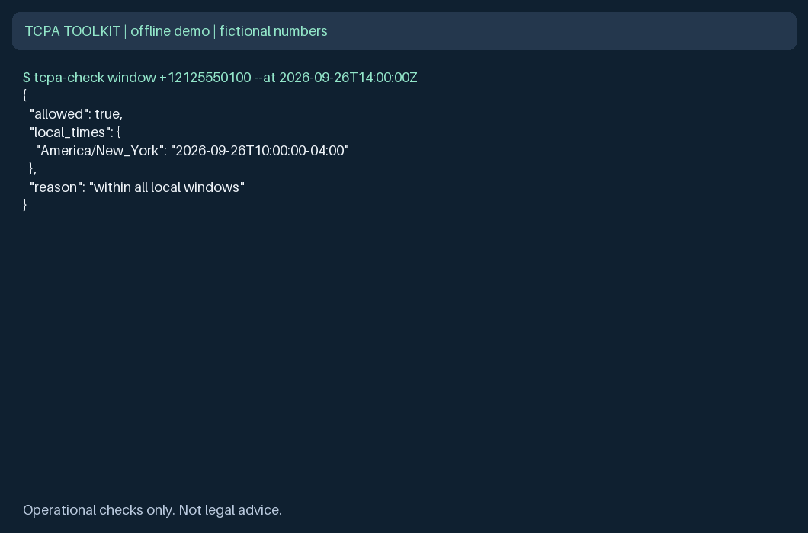
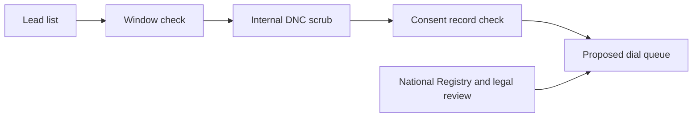
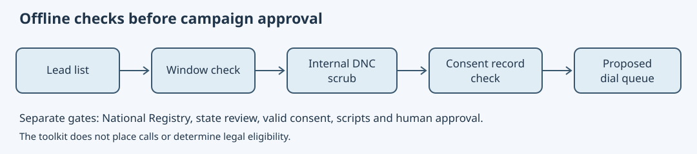

# TCPA compliance checklist for outbound calls and AI voice agents

**A practical TCPA compliance checklist with an offline Python toolkit for calling hours, internal DNC scrubbing and consent evidence records.**

[](https://github.com/jbrazy480/tcpa-compliance-checklist/actions/workflows/ci.yml)
[](LICENSE)
[](pyproject.toml)
[](https://aiguyofficial.com/resources?utm_source=github&utm_medium=readme&utm_campaign=tcpa-compliance-checklist)



## What it does

- Provides a cited [human checklist](CHECKLIST.md) and matching [YAML items](checklist.yaml) with stable IDs.
- Checks local calling windows using bundled US/Canada NPA hints, IANA zones and DST.
- Scrubs CSV rows against your internal suppression files and reports removed record numbers.
- Validates JSONL consent evidence structure using [Draft 2020-12 JSON Schema](consent_log.schema.json).
- Reports checklist progress from a local status file. Makes no calls or network requests.

## Who this is for

US outbound teams, agencies, campaign reviewers and engineers building controls around AI voice agents. Canadian NPAs support timezone estimation only; this is not a Canadian legal checklist. The toolkit is a set of independent checks, not a dialer or compliance certification.

## Quickstart: 60-second offline demo

Python 3.11+ and system IANA timezone data are required. Initial dependency installation needs a package index or a prepared local wheel cache. All demo commands then run offline with no keys. On systems without an IANA database, install system timezone data first.

```bash
python3 -m venv .venv
source .venv/bin/activate
pip install -e . -r requirements-dev.txt
mkdir -p data
tcpa-check window +12125550100 --at 2026-09-26T14:00:00Z
tcpa-check next +14155550101 --at 2026-09-26T12:00:00Z
tcpa-check scrub examples/leads.csv data/clean.csv --dnc examples/internal_dnc.txt
tcpa-check consent-validate examples/consent.jsonl
tcpa-check checklist examples/status.yaml
```

The fixture uses fictional 555-01xx numbers. The scrub removes the internal DNC match and malformed number. A valid demo consent record is only a schema example, not an approved consent form.

Equivalent module entry point: `python -m tcpa_toolkit`. Replay every command with `python scripts/run_demo.py`. Generate the animation from actual command output with `python scripts/make_demo_gif.py`. Pillow is a development dependency only. Checklist output in the GIF is summarized for readability.

## Configuration

| Setting | Default | How to set it |
| --- | --- | --- |
| Environment variables | None | No credentials needed |
| Local opening time | `08:00` | `--start HH:MM` |
| Local closing time | `21:00` | `--end HH:MM` |
| Verified timezone | NPA candidates | `--tz-override America/New_York` |
| Timestamp | Required | `--at` with an ISO UTC offset |
| CSV phone column | `phone` | `--phone-column` |
| Internal DNC files | Required for scrub | `--dnc file1.txt file2.txt` |

[examples/window.yaml](examples/window.yaml) illustrates policy values for an integration to read. The CLI takes flags explicitly and does not auto-load that file. Windows must stay within 08:00-21:00, with start before end; overnight and broader windows are rejected. The end is exclusive as a conservative policy choice. Weekends, holidays, state-specific rules and campaign exceptions require separate controls.

[examples/status.yaml](examples/status.yaml) maps checklist IDs to `todo`, `done`, or `not_applicable`. Missing IDs default to `todo`; unknown IDs and invalid statuses fail. `done` counts completed items only, and the denominator includes all items. Review the justification for every `not_applicable` item outside the status file.

## Architecture





The diagram is a suggested integration sequence. Commands operate independently and do not build an authorized dial queue. Applications must combine the results, resolve consent and jurisdiction questions, and recheck suppression and hours at dispatch.

## How do the Python functions work?

```python
from datetime import datetime, timezone
from tcpa_toolkit.calling_window import is_callable, next_allowed_time

at = datetime(2026, 9, 26, 14, tzinfo=timezone.utc)
result = is_callable('+12125550100', at, start='09:00', end='20:00')
print(result.allowed, result.local_times, result.reason)
print(next_allowed_time('+12125550100', at))
```

`WindowResult` contains `allowed`, `local_times` (IANA names mapped to offset-bearing ISO strings), and `reason`. Every candidate timezone must be within the window. A verified `tz_override` replaces all NPA hints. Invalid E.164 syntax, naive datetimes, invalid zones and invalid windows raise `ValueError`. Unknown NPAs return `allowed=False` with `unknown timezone, supply tz_override`.

`next_allowed_time` returns an aware UTC datetime at or after the input, preserving the exact instant if already allowed. It returns `None` for unknown zones or no intersection within its 370-day search horizon. It traverses UTC minute boundaries, avoiding repeated/nonexistent local times at modern DST changes. This is a contemporary scheduling helper, not a historical timezone reconstruction tool. Minute-resolution windows may have no common interval across candidate zones.

## Where does the timezone data come from?

The bundled [NPA map](tcpa_toolkit/data/npa_timezones.json) contains 414 NPAs, counted from this snapshot. It derives from [Google libphonenumber timezone metadata](https://github.com/google/libphonenumber/blob/master/resources/timezones/map_data.txt), retrieved 2026-09-26. All US/Canada entries sharing an NPA are unioned, including more-specific prefixes. Country-wide and non-geographic fallback entries are omitted. See the [source notice and hash](tcpa_toolkit/data/NOTICE) and [Apache 2.0 license](tcpa_toolkit/data/LICENSE-libphonenumber.txt).

The upstream file identifies its original statistical source as 2018-06-12. This snapshot is reasonably broad, not a guarantee of current assignment coverage or location accuracy. New overlays can be unknown; non-geographic numbers are deliberately blocked without an override. Phone portability and travel make area codes unreliable evidence of current location. Verify location directly, preserve that evidence, and refresh data before operational use. Some equivalent IANA zones are retained because their historical rules differ.

## Does scrubbing check the National DNC Registry?

No. `load_dnc(paths)`, `is_dnc(phone, numbers)` and `scrub_csv(input, output, dnc_files, phone_column)` operate only on your supplied internal files. Each DNC file has one number per line, with optional blank lines and `#` comments. Common US ten-digit and +1 display formats normalize to E.164. Syntax normalization does not establish number assignment, country, ownership or consent; other NANP countries share +1.

Malformed DNC entries abort the job. Malformed lead phones are removed and reported. Malformed CSV structure aborts before output is written. Output must differ from the lead and DNC files. Existing output is replaced on success. Retained CSV values are preserved. The report contains total, kept and removed counts plus record numbers and reasons, without phone values. Lists are loaded into memory; use a controlled batch size for large files.

National Registry access is separate through the FTC's [telemarketing.donotcall.gov](https://telemarketing.donotcall.gov/) with a subscription account and applicable seller permissions. See [FTC access guidance](https://www.ftc.gov/business-guidance/resources/qa-telemarketers-sellers-about-dnc-provisions-tsr-0) and [47 CFR 64.1200(c)(2)](https://www.ecfr.gov/current/title-47/section-64.1200).

## Does a valid consent log mean we can call?

No. `validate_consent_log(path)` returns `valid`, `records` and line-numbered `errors`. Every JSONL line must be a record; empty files and blank lines fail. Required fields are phone, consent type, timestamp, source, exact disclosure text and evidence reference. Optional fields are an absolute HTTP(S) source URL, IP address, user agent and revocation timestamp. Timestamps require offsets and calendar-valid dates; leap seconds are not supported. Unknown fields, invalid formats and revocation before consent fail.

A revoked record can be structurally valid. Validation does not retrieve evidence, authenticate signatures, interpret disclosures, check seller scope, establish current ownership, or decide whether consent remains effective. The two consent-type labels are evidence categories, not permissions or exemptions. Keep the signed agreement and authorized seller details behind the evidence reference. Protect real records as sensitive information; do not commit them.

## What do CLI exit codes mean?

`0` means the requested operation succeeded; `1` means the window is blocked, no next time was found, or consent validation failed; `2` means bad arguments or an input/file error. Scrub success means the output and removal report were produced, not that every row was retained. Checklist progress always reports status, not legal clearance. Normal results are JSON on stdout and handled errors are JSON on stderr; argparse usage errors use its standard text format. No background logging or automatic audit persistence occurs.

## Testing

```bash
pytest -q
python scripts/run_demo.py
python scripts/make_demo_gif.py
python -m build
```

Tests cover local boundaries, DST changes, multi-zone intersections, stricter policies, unknown NPAs, invalid input, schema formats, revoked records, CSV reports, package data and CLI exit codes. Tests make no network requests. CI tests Python 3.11, 3.12 and 3.13, runs the demo, generates the GIF and builds distributions.

## Compliance note (not legal advice)

Last reviewed 2026-09-26. Not legal advice. Laws change; confirm with counsel.

AI-generated human voices fall within TCPA artificial-voice restrictions under [FCC 24-17](https://docs.fcc.gov/public/attachments/FCC-24-17A1.pdf). Applicable consent, identification, opt-out, DNC and hours requirements depend on the call. Start with the cited [CHECKLIST.md](CHECKLIST.md) and [47 CFR 64.1200](https://www.ecfr.gov/current/title-47/section-64.1200). Review each state you call. These tools do not replace National Registry checks, your compliance process or legal review.

## How does this compare with other approaches?

| Approach | You receive | You still own |
| --- | --- | --- |
| This starter | Checklist, offline helpers, fixtures and tests | Legal review, integrations, data freshness and evidence |
| Build from scratch | Full control over implementation | All code, testing, policy interpretation and operations |
| Hosted platform | Provider-specific calling workflows | Vendor diligence, valid consent and campaign compliance |

## FAQ

### Does this place calls?

No. There are no telephony credentials, integrations or live-call commands.

### Can I widen the calling window?

No. Set stricter hours within the supported range; broader exceptions need a separately reviewed implementation.

### Can I use a mobile number's area code as proof of location?

No. Verify the called party location and supply an IANA override when known.

### Does it implement state or Canadian law?

No. Review applicable jurisdictions separately. No state-specific rules are encoded.

### How much does the demo cost to run?

It runs locally with no paid service calls. National Registry access is separate; consult the [FTC subscription portal](https://telemarketing.donotcall.gov/) for applicable fees.

## Going further

Get free resources, templates and community at [AI Guy resources](https://aiguyofficial.com/resources?utm_source=github&utm_medium=readme&utm_campaign=tcpa-compliance-checklist).

RizzDial is a commercial calling platform with predictive, power and parallel dialing and contact-level do-not-call handling.

It does not replace your own compliance process or legal review.

[RizzDial](https://rizzdial.com/dialer?utm_source=github&utm_medium=readme&utm_campaign=tcpa-compliance-checklist)

## License

[MIT](LICENSE) covers this starter only. Bundled derived timezone data retains its Apache 2.0 license and notice. Maintained by James Hill (The AI Guy).
